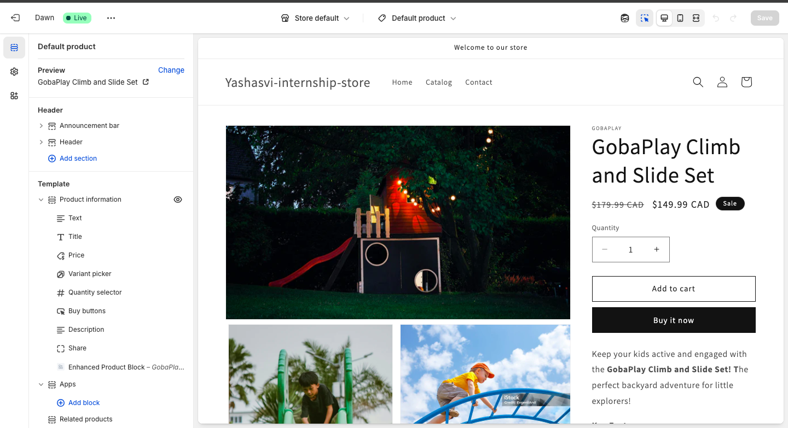
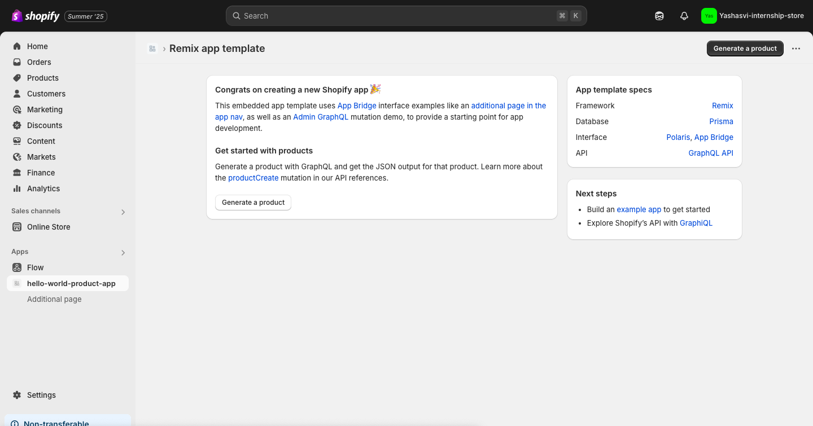
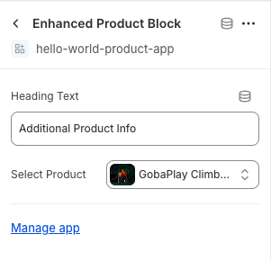
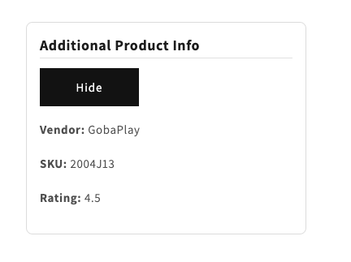
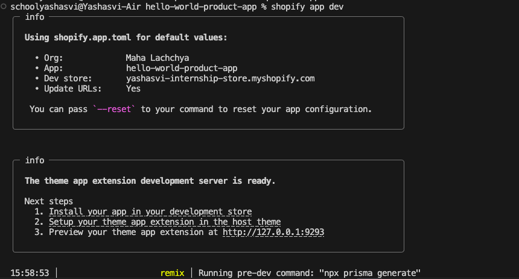

# Shopify Development Exercise - Hello World Block Extension

## Project Description
This is a simple Shopify theme app extension that adds a customizable text block, with hide/show buttons to display more product info, to product pages. It was built as part of a take-home assignment to demonstrate familiarity with Shopify's CLI, theme extensions, and storefront customization. 

Link to store preview: https://yashasvi-internship-store.myshopify.com

## How It's Made

### Tech Used: Shopify CLI, Liquid, HTML, CSS (inline), JSON, Git
Following the assignment instructuions and to meet the requirements, I initialized a Remix app using Shopify CLI, configured the app for product page, and then created the extension to implement the "Hello World!" functionality. This extension creates a simple block that can be added into the theme editor via the Shopify admin. I styled it using inline CSS for visibility and ensured it could be reused across multiple product pages. 

## Setup Instructions
1. Clone the repository 
2. Ensure you have the latest Shopify CLI installed and Node.js (version 18.20+)
3. Install NPM packages:
npm install 
4. Run the local development server. Follow prompts to connect to your Partners account and select your development store. Install the app in your development store when prompted:
shopify app dev
5. Preview the extension! 
  - Go to your Shopify Admin.
  - Navigate to Online Store -> Themes -> Customize.
  - Open the Product template.
  - Click Add block -> Hello World Block under App Blocks.

## Challenges 
1. First challenge I encountered was with npm install of the CLI, specifically the "npm error code EACCES" error. To go around this permission issue, I used sudo to grant temporary admin privileges, although, this led me to the same error. I then re-installed the packages, this time without @shopify/theme, as I was warned that it had now been bundled inside the CLI, but to no avail. I then opted for homebrew to install CLI, however, due to my older system and limiting RAM, this process was taking me hours. Then I visited https://shopify.dev/docs/apps/build/scaffold-app for guidance along the process, and ran shopify app init. This led me to more NPM issues specifially npm error code EEXIST, that tried to move or rename a file that already exists, along with the EACCESS error. This suggested I had both corrupted or stale cache, as well as file permission issue. Consulting this issue on Stackoverflow, I came across a solution of running sudo npm cache clean --force, which resolved both the EACCESS and EEXIST issue by clearing the npm cache, allowing me to run shopify app init, and follow through with the steps from the site. 

2. Another bump I encountered was during the creation of a new app. When attempting to scaffold an app, I initially ran shopify app generate, expecting to be guided interactively, however, it returned usage instructions. This non-intuitive CLI structure slowed me down until I better understood Shopify’s command hierarchy. For guide, I also watched some youtube tutorials on explanation of Shopify App Extensions, to get more familiar with this CLI. 

3. Since this was my first time working with Shopify CLI, I had to learn about locales, as well as snippets and its functionality, that came with the first initial block extension of star_rating. 

## Stretch Goals Documentation (Stretch Goal 1)
### Decision Rationale 
When selecting which stretch goals to implement, I prioritized features that would create real-world utility, enhance merchant experience, and showcase front-end technical competency. I approached the stretch goals with the mindset of a merchant: what would make this block more useful, flexible, and visually appealing when showcasing products?
1. Configurable Text Block: 
I wanted the block to feel flexible and user-friendly. Hardcoding a heading like "Product Info" limits usability. Adding a theme customizer field that lets merchants set their own title text — whether it's "More Details", "Specifications", or even a translated phrase. 
2. Product Info Display:
Displaying product data makes the block functional as SKU and vendor are common data points that store owners often want visible on product pages. I also included a metafield-based rating example (demo.avg_rating) to show how the block could be extended to support custom store-specific fields. This also allowed me to practice accessing nested product data (variants.first.sku) and using conditional logic in Liquid (). 
3. Interactive Element
I added this to improve the user experience and demonstrate JavaScript integration. Rather than overwhelming users with too much info up front, the toggle lets them reveal details only if they’re interested. I initially explored a ripple animation, but reverted to Shopify’s clean button aesthetic to maintain brand consistency. Implementing this required me to set up scoped event listeners using data-block-id, write JavaScript in a reusable, modular format (hidescontent.js), use semantic data attributes (data-toggle-button, data-toggle-content), and ensure accessibility with clear labels (Show/Hide). This goal also helped me show how JavaScript and Liquid can coexist cleanly in theme blocks! 
4. Styling Enhancements
Shopify has a clean, professional design, so I avoided heavy colors, shadows, or animations. Instead, I styled the block with a soft grey border, rounded corners, consistent padding, and system font stack (to match the theme). 

### Technical Approach 
- To display product info, I levereged Liquid to structure the product data conditionally. 
- Used custom attributes (data-toggle-button, data-toggle-content) and a modular JS file (hidescontent.js) to enable a clean toggle interaction.
- Ensured reusability and scoping by applying data-block-id="{{ block.id }}" to isolate each block instance’s logic

An issue I encountered was with making the text customizable. 
I initially attempted to add a theme customizer setting to allow merchants to edit the block heading. To do this, I used a "text" input in the block schema:
{
  "type": "text",
  "id": "custom_text",
  "label": "t:customize_hello.label",
  "default": "t:customize_hello.default"
}

At first, this seemed correct based on how Shopify uses localization (t: keys) in schemas. However, when I loaded the block in the theme editor, I saw this error:
missing translation: "t:customize_hello.label"

Despite having a locales/en.schema.json file with what I believed were correct keys, the text still failed to render. I realized that the fastest and most reliable solution, especially for a single-language block was to avoid using t: altogether and hardcode the label and default like this:

{
  "type": "text",
  "id": "custom_text",
  "label": "Customize Text",
  "default": "Hello World!"
}
This debugging process taught me:
- How Shopify schema localization works under the hood
- When to use t: keys (multi-language projects) vs. when not to (simple blocks)
- How schema files and Liquid logic interact
- The importance of restarting the shopify app dev server to clear stale schema caches
- Most importantly, it reminded me that reading error messages carefully, simplifying your setup, and eliminating variables is often the best way to get unstuck.

### Time Investment
- Core Hello World block: ~30 minutes
- Custom text + product info display: ~1.5 hours
- Interactive toggle implementation (JS + Liquid): ~2 hours (including ripple effect testing and rollback)
- Styling + polish + error handling: ~1 hour
- Documentation, commenting, and GitHub setup: ~1.5 hours
- Total additional time for stretch goals: ~6.5 hours

### Future Improvements
If I had more time, I would:
- Include Shopify’s native app block styling tokens instead of inline styles for theme consistency. Since this take home specifically focused on Dawn, it was not a need, but using the theme tokens would make the block blend visually into any theme, and shows accessibility and responsiveness. 
- Add transition effects for the toggle (e.g. smooth slide-down animation). Grouping additional info into a block that becomes visible at users choice recudes cognitive load (Miller's Law) as it is, but this feature would further improve user experience and make the interface feel more polished. 
- Explore schema localization for multi-language support. We could use t: keys in the schema and supply proper en.schema.json. This makes the block work in multilingual stores, which are common for international merchants.

## Development Process
1. Installed Shopify CLI and initialized a Remix app
2. Resolved CLI errors and permissions (npm, EACCES/EEXIST) 
3. Generated an app extension and implemented the required functionality by modifying the extension
4. Styled it to be clearly visible
5. Tested the block extension across product pages and saved theme changes 
6. Attempted Stretch Goal 1
7. Documentation and commenting
8. Pushed all code to the git repo 

## Time spent 
CLI Setup + Troubleshooting: ~ 6 hours  
Extension Development:       ~ 3 hours    
Testing & Styling:           ~ 1.5 hours  
Documentation:               ~ 1.5 hours   
Total time spent on the exercise: ~ 12 hours  